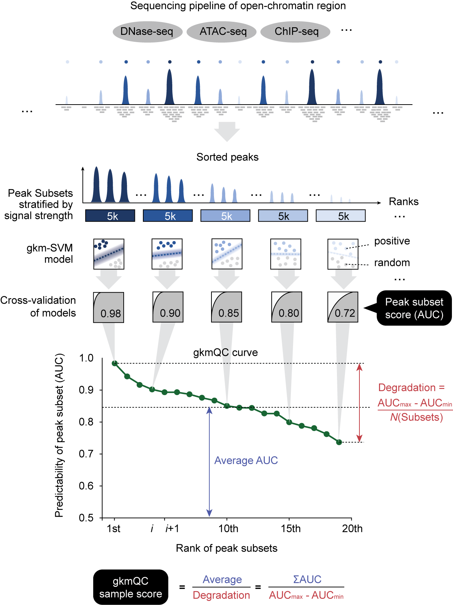

## gkmQC: gapped k-mer-SVM quality check and optimization

 

gkmQC is a sequence-based quality assessment and refinement of
chromatin accessibility data using gkm-SVM.
Especially, gkmQC enables us to optimize open-chromatin peaks
for rare cell-types in single-cell ATAC-seq data.
It trains a support vector classifier (SVC) using gapped-kmer kernels
(Ghandi et al., 2014; Lee, 2016), and learns sequence features that modulate
gene expressions. We use LIBSVM (Chang & Lin 2011) for implementing SVC.


requires 

* Python >=3
* numpy
* sklearn
* bitarray
* pyfasta

Set conda virtual environment
```bash
$ conda env create -f environment.yml
$ conda activate gkmqc
```


Please compile C library for gkm-kernel
```bash
$ cd src
$ make && make install
```


To prepare null-seq index,\
(1) download precalculated one:\
[gkmqc.idx.hg38.tar.xz](https://www.dropbox.com/s/wtjylew5ybim29x/gkmqc.idx.hg38.tar.xz?dl=0) (5.8 GB), [gkmqc.idx.mm10.tar.xz](https://www.dropbox.com/s/qye3ts8jep78o3u/gkmqc.idx.mm10.tar.xz?dl=0) (4.5 GB)
```bash
$ cd data
$ tar xvfJ gkmqc.idx.hg38.tar.xz
```

(2) or build your own null-seq index with chromFa.tar.gz file:\
[hg38.chromFa.tar.gz](https://hgdownload.soe.ucsc.edu/goldenPath/hg38/bigZips/hg38.chromFa.tar.gz) (938 MB), [mm10.chromFa.tar.gz](https://hgdownload.soe.ucsc.edu/goldenPath/mm10/bigZips/chromFa.tar.gz) (830 MB)
```bash
$ cd data
# run buildindx command; takes 15 mins with 10 threads
$ ../bin/gkmqc.py buildidx -i hg38.chromFa.tar.gz -g hg38 -@ [threads]
```


Evaluate your called peaks and check your gkmQC curve.
```bash
# run evaluate command; takes 1 ~ 2 hrs with 10 threads
$ cd test
$ ../bin/gkmqc.py evaluate -i foo.narrowPeak -g hg38 -n foo -@ [threads]
$ cat foo.gkmqc/foo.gkmqc.eval.out
```

Optimize your called peaks with gkmQC AUC scores.
```bash
# run optimize command;
# requires gkmQC results of called peaks with original and relaxed cut-off
# foo, foo_rc: prefixs of gkmQC result with peaks from either original, relaxed cut-off
$ cd test
$ ../bin/gkmqc.py optimize -p1 foo -p2 foo_rc
$ cat foo.gkmqc/foo.e300.optz.bed
```

You can check the options with -h arg of gkmqc.py
```bash
$ cd bin
$ ./gkmqc.py -h
$ ./gkmqc.py buildidx -h # Building null-seq index
$ ./gkmqc.py evaluate -h # run gkm-SVM to evaluate peaks
$ ./gkmqc.py optimize -h # run gkmQC to optimize peaks
```


Please cite below papers
* Han SK, Sampson MG, Lee D. Quality assessment and refinement of non-coding regulatory map using a sequence-based predictive model.
* Ghandi M†, Lee D†, Mohammad-Noori M, & Beer MA. Enhanced Regulatory Sequence Prediction Using Gapped k-mer Features. PLoS Comput Biol 10, e1003711 (2014). doi:10.1371/journal.pcbi.1003711 *† Co-first authors*
* Lee D. LS-GKM: A new gkm-SVM for large-scale Datasets. Bioinformatics btw142 (2016). doi:10.1093/bioinformatics/btw142
* Chang C.-C and Lin C.-J. LIBSVM : a library for support vector machines. ACM Transactions on Intelligent Systems and Technology, 2:27:1--27:27, 2011.

